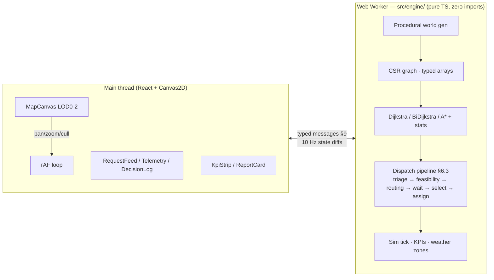

# CareGrid — Rural Emergency Dispatch Intelligence

**CareGrid** is a district-scale EMS dispatch console for **Baran district, Rajasthan** — a full road-network routing engine, a transparent decision pipeline, and a live operational map, all running in the browser in a single Web Worker.

## The Problem

In rural India the golden hour is usually lost before an ambulance even moves. Emergency care runs up a **ladder of facilities** — *Health Sub-Centre → PHC → CHC → District Hospital* — and each rung differs in what it can actually treat: a cardiologist may be on duty only until 18:00, a CHC's streptokinase stock may be expired, a PHC's beds may be full. Choosing the *nearest* hospital instead of the *fastest reachable-and-capable* one costs lives. Baran is a useful stress case: ~1.2M people spread over ~7,000 km² across 5,200+ villages, connected mostly by class-2 roads where monsoon can cut routes for days.

CareGrid answers one question per emergency: **which ambulance should go, to which facility, by which route — right now?** — and shows its reasoning for every single dispatch.

## Live demo

**https://caregrid-two.vercel.app**

Reproducible runs: append `?seed=42&scenario=mock` — world generation, traffic, and the Official Mock scenario are fully deterministic from the seed.

## Architecture



The engine never touches the DOM; the UI never computes a path. The worker owns the world (~5 MB of typed arrays); the main thread receives 10 Hz diffs plus geometry transferables once at boot.

## The Engine

Every dispatch runs an 8-stage pipeline:

`TRIAGE` (severity-heap) → `FEASIBILITY` (specialty on duty ∧ bed free ∧ meds in date ∧ doctor shift window) → `ROUTING` (A\* to ≤6 nearest eligible facilities) → `WAIT` (queueing estimate) → `SELECT` (argmin of total cost) → `ASSIGN` (lock unit, reserve bed + FEFO med batch) → `TRACE` (full breadcrumb) → `DISPATCH`.

Cost model per mission: `travel + on-scene (600 s "platinum ten") + transport + wait`, where
`wait(facility) = ceil(activeInbound / max(1, bedsFree)) × 900 s`.

Roads: an arterial highway skeleton (80 km/h) over district roads (50 km/h) and village roads (30 km/h); monsoon zones multiply drive times up to 1.5×.

### Algorithms & complexity

| Algorithm | Complexity | Notes |
|---|---|---|
| Dijkstra | O((V+E) log V) | early exit at target |
| Bidirectional Dijkstra | O(2·b^(d/2)) | two search fronts meet in the middle; reverse graph cached per map |
| A\* | O((V+E) log V) bound | heuristic = haversine / 80 km/h — admissible (80 km/h is max road speed) |

### Measured benchmarks (FULL world — 50,000 nodes · 344,100 directed edges · 200 random pairs)

| Algorithm | mean ms | p95 ms | mean expanded | mean relaxed | heapOps |
|---|---|---|---|---|---|
| Dijkstra | 6.27 | 12.30 | 25,535 | 176,967 | 71,849 |
| Bidirectional | **3.52** | **8.43** | 15,251 | 105,789 | 43,466 |
| A\* | 3.88 | 11.61 | **12,243** | **85,016** | **35,609** |

Graph: 1 component · heap microbench ≈ **50M push/pop ops/sec** (random keys, result consumed) · world generation ≈ 3.5 s · CSR memory ≈ 5 MB typed arrays @ 50K nodes / 344K edges. Run the suite yourself in-app: **Speed Tests tab**.

A\* touches the fewest junctions and roads (the haversine heuristic focuses the search); bidirectional is the fastest wall-clock because two half-depth fronts meet early. All three return the same fastest route — the difference is how much of the map each one has to look at.

### SLA targets (to scene arrival)

| Urgency | SLA |
|---|---|
| ECHO (cardiac arrest) | 8 min |
| DELTA | 15 min |
| CHARLIE | 30 min |
| BRAVO | 60 min |
| ALPHA | 120 min |

## Edge-case behavior matrix

| Trigger | Behavior | Where visible |
|---|---|---|
| No direct route | A\* returns ∞ → reject UNREACHABLE, try next-best facility; all fail → UNREACHABLE status + feed alert | Breadcrumb + feed |
| Specialist unavailable | duty-window filter → farther qualified facility chosen | Official Mock scenario |
| Fleet exhausted | QUEUED persists, telemetry queue grows, degraded banner at 0 available | Telemetry |
| Beds/meds depleted | NO_BEDS / NO_MEDS rejects; partial fulfillment + restock | Breadcrumb |
| Simultaneous emergencies | batch-optimal (≤5) vs greedy toggle, Δ shown | Decision log |
| Mid-route closure | re-route from ambulance's current position, delta logged | Map + feed |
| Island village | union-find at load flags it; live sever → UNREACHABLE handling | Map flag |
| Specialist off-shift mid-pipeline | duty filter at decision time; in-flight mission unaffected (handover honored) | Log |
| Duplicate requests | 120s dedupe window merges, logged once | Feed |
| SLA impossible | ⚠ best-effort flag at creation | Feed |
| Tab throttled | catch-up cap 30s, sim clock reconciles | Clock |
| Corrupt world file | load validation → error card, never white-screen | Boot |
| ECHO arrives, fleet at zero | preemption (§6.2.9): newest TO_SCENE non-ECHO mission re-allocated to the ECHO; patient re-queued front-of-tier, `PREEMPTED` breadcrumb | Decision log + feed |
| Thousands of concurrent influxes | triage heap absorbs all; backpressure; feed caps at top-50 + "+N more"; `Stress surge ×1000` demonstrates live (§13.2) | Telemetry + feed |

## Why percentiles

We report **P50/P90 response times, not means**. EMS convention: the tail is the story. A mean of 11 minutes can hide a P90 of 25 minutes — exactly the villages where outcomes collapse. The KPI strip and ReportCard therefore show per-tier P50/P90 and SLA% per urgency tier.

## Accessibility & field readiness

- **Offline-first PWA**: zero runtime data dependencies — installable, survives network kill.
- **हिंदी interface**: full EN/हिंदी toggle (TopBar).
- **Keyboard-first**: `Space` pause · `1/2/3` speed · `E/D` inject emergency · `M` mode · `F` follow-cam · `W` wavefront · `R` report · `?` shortcuts.
- **Screen-reader aware**: `aria-live` announces every dispatch.
- **Reduced motion** respected via media query; high-contrast urgency palette; tabular-numeral clocks for scanability on night shifts.

## Human-in-the-loop

AUTO mode dispatches instantly (ECHO cardiac arrests are protocol-exempt — always auto-dispatched). **MANUAL** mode turns the console into a decision-support tool: the engine proposes, a human dispatcher confirms, with auto-escalation if confirmation lapses past 80% of the SLA. Every recommendation carries its full breadcrumb — chosen facility, total time decomposition, and every rejected alternative with its reason code (`NO_SPECIALTY`, `NO_BEDS`, `NO_MEDS`, `UNREACHABLE`).

## Third-party disclosures

See [DISCLOSURE.md](./DISCLOSURE.md).

## Running locally

```bash
npm i
npm run dev      # http://localhost:5173
npm test         # vitest suite (23 tests)
npm run verify   # headless Official Mock assertion
npm run build    # typecheck + production build
```

Requires Node 18+. No API keys; weather uses keyless Open-Meteo with a synthetic fallback.

## Limitations

CareGrid is a **simulation and decision-support prototype, not a certified CAD (Computer-Aided Dispatch) system**. Clinical parameters (on-scene times, drug coverage, staffing windows) are synthetic but structurally faithful. Scope is a single district; national scale needs ALT/CH preprocessing (below).

## Future Additions

> CareGrid's 5-hour scope was deliberately bounded. On the roadmap: **ALT (A\* + Landmarks)** and Contraction Hierarchies for national-scale graphs; 4-ary/pairing-heap benchmarking beyond the binary baseline; **multi-leg referral journeys** (HSC→PHC→CHC→DH) with per-leg SLA accounting; **cold-chain medicine logistics** with courier-based restock routing; **clinical outcome modeling** grounded in published trauma literature, blood-product matching, isolation-bed capability; vehicle lifecycle events (breakdowns, on-scene complications, in-transit medicine expiry) with auto re-dispatch; hospital diversion workflow and time-of-day staffing models; live property-based self-validation dashboard; replay scrubber, scenario import/export, operator onboarding, audio cues; production integrations — live AVL/GPS feeds, HL7/FHIR hospital-IS bridge, SMS/IVR request intake, ML demand forecasting on historical arrivals, CI/CD with preview deployments.
